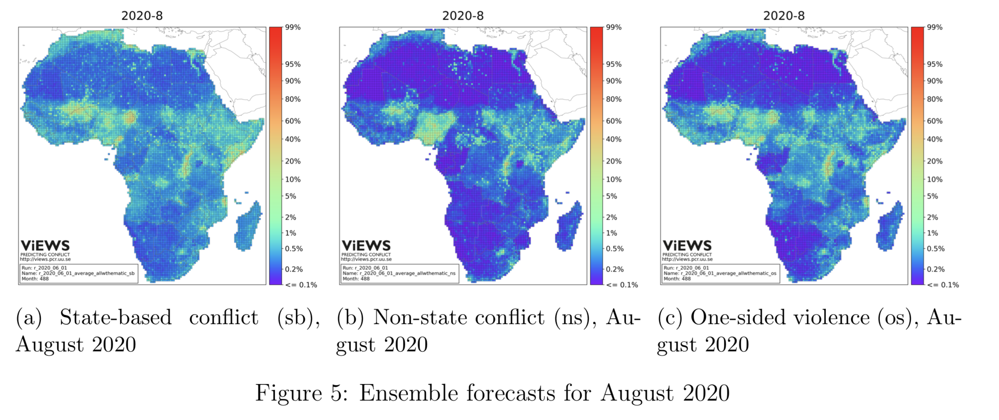

# Abstract

In this research report we discuss the use of accuracy as a performance metric in machine learning applications.
We illustrate that accuracy fails to account for the social, spatial, and dynamic contexts within which measures and inferences are made.
Our group offers a new metric that is more appropriate for computational social science projects that nest data science within society. 

## Literature Review

Computational social science projects ranging from text as data, to image analysis, to high resolution violence forecasting have accelerated over the last several years. Many of their innovations have been driven by flexible machine learning algorithms. The Violence Early Warning System (ViEWS) provides one example. The teams most recent predictions are presented in the fiture below.

{ width=75% }
## Approach

As the map makes clear, violence prediction has strong spatial components; yet these are not considered in bin-by-bin machine learning performance metrics, such as accuracy, AUC, precision, recall, F1, the Brier Score, and others. 

In each of these classes, the bin-by-metrics take on the form:

$$
\sum_{i}^{M} f(y_{i}, \hat{y}_{i})
$$

Where for accuracy, $f$ is replaced with the indicator functions:

$$
f = \mathcal(I)[y_{i}==\hat{y}_{i}]
$$

Our appreach relaxes this assumption by estimating and presenting a flow of mass across a generic graph that can be designed by the researchers.
## Results

Our algorithm provides new insights into well and poor performing algorithms that are not available with accuracy or other bin-by-bin metrics.

## Conclusion

Our work complements existing approaches to define domain specific cost functions. In the future we plan to incorporate quantum computing to speed up inference over multiple flows.
